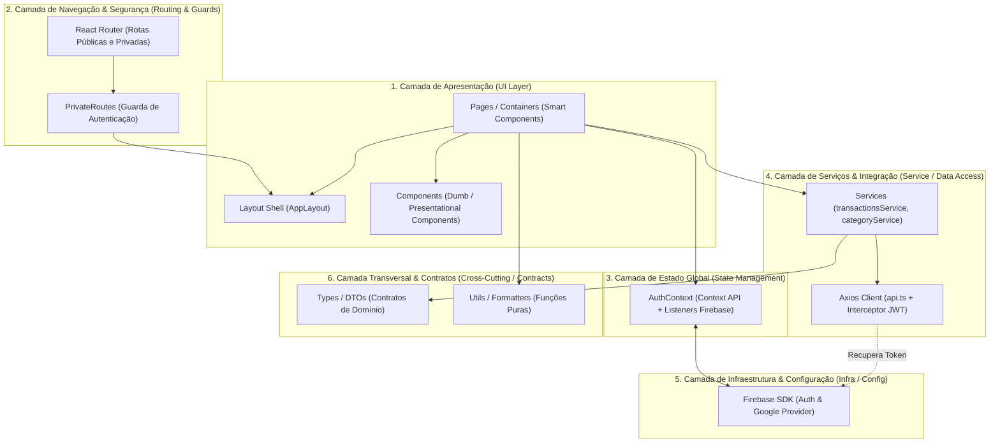

# 💳 DevBills - Frontend

O **DevBills** é uma plataforma moderna intuitiva de controle financeiro pessoal. Este repositório contém a aplicação **frontend** desenvolvida com **React**, **TypeScript**, **Vite** e **Tailwind CSS**, oferecendo uma experiência de uso fluida, com autenticação integrada via Firebase Google Sign-In, dashboards analíticos com gráficos interativos e gerenciamento detalhado de transações financeiras.

---

## ✨ Funcionalidades Principais

- **🔒 Autenticação com Google (Firebase Auth)**:
  - Login rápido e seguro via popup com Google Sign-In (`signInWithPopup`).
  - Gerenciamento de sessão global (`AuthContext`) com escuta em tempo real (`onAuthStateChanged`).
  - Injeção dinâmica do token Bearer JWT nas requisições HTTP via interceptors do Axios (`user.getIdToken()`).
  - Proteção de rotas com redirecionamento automático (`PrivateRoutes`).

- **📊 Dashboard Financeiro Completo**:
  - Cards com indicadores-chave de desempenho (KPIs): Saldo Total, Total de Receitas e Total de Despesas.
  - Gráficos visuais interativos construídos com **Recharts**:
    - Distribuição de despesas por categoria (gráfico em pizza/donut).
    - Evolução e histórico financeiro dos últimos meses.
  - Filtro por competência mensal e anual (`MonthYearSelect`).

- **💸 Gestão e Histórico de Transações**:
  - Listagem paginada e detalhada de transações (receitas e despesas).
  - Filtros dinâmicos e combinados por Categoria, Tipo (Receita/Despesa) e Período (Mês/Ano).
  - Exclusão de transações com confirmação e atualização reativa do dashboard e do saldo.

- **➕ Cadastro de Movimentações**:
  - Formulário intuitivo para inclusão de novas receitas ou despesas (`TransactionsForm`).
  - Seletor de tipo de transação (`TransactionTypeSelector`) com feedback visual.
  - Seleção dinâmica de categorias vindas da API backend.
  - Formatação e máscara automática de moeda em padrão Real brasileiro (BRL).

- **🎨 Design System & UI/UX**:
  - Interface moderna com Dark Mode nativo e estilização utilitária de alta performance com **Tailwind CSS v4**.
  - Ícones consistentes e elegantes com **Lucide React**.
  - Notificações visuais e toasts informativos de sucesso e erro com **React-Toastify**.

---

## 🛠️ Tecnologias Utilizadas

- **[React](https://react.dev/)**: Biblioteca principal para renderização declarativa e baseada em componentes funcionais.
- **[TypeScript](https://www.typescriptlang.org/)**: Tipagem estática rigorosa para garantir segurança e previsibilidade em toda a aplicação.
- **[Vite 8](https://vite.dev/)**: Ferramenta de build de última geração com inicialização instantânea e Hot Module Replacement (HMR).
- **[Tailwind CSS](https://tailwindcss.com/)** (`@tailwindcss/vite`): Framework de estilos utilitários integrado diretamente ao pipeline do Vite.
- **[React Router](https://reactrouter.com/)**: Gerenciamento de rotas com suporte a layouts aninhados e rotas protegidas.
- **[Firebase Authentication](https://firebase.google.com/docs/auth)**: Provedor de identidade e autenticação federada com Google.
- **[Axios](https://axios-http.com/)**: Cliente HTTP configurado com timeout e interceptor assíncrono para renovação e envio de tokens JWT.
- **[Recharts](https://recharts.org/)**: Visualização de dados e gráficos responsivos para dashboards financeiros.
- **[Lucide React](https://lucide.dev/)**: Pacote de ícones SVG limpos e modernos.
- **[React Toastify](https://fkhadra.github.io/react-toastify/)**: Notificações flutuantes com temas coloridos.
- **[Biome](https://biomejs.dev/) & [ESLint](https://eslint.org/)**: Ferramentas modernas de linting e formatação de código.

---

## 📁 Estrutura de Pastas

```text
devbills-frontend/
├── src/
│   ├── components/             # Componentes de interface reutilizáveis
│   │   ├── button.tsx          # Botão com variantes de cor e tamanhos
│   │   ├── card.tsx            # Card base para exibição de métricas e gráficos
│   │   ├── footer.tsx          # Rodapé da aplicação
│   │   ├── GoogleLoginButton.tsx # Botão estilizado para autenticação com Google
│   │   ├── header.tsx          # Cabeçalho com navegação, dados do usuário e logout
│   │   ├── MonthYearSelect.tsx # Seletor interativo de mês e ano para filtragem
│   │   ├── select.tsx          # Componente de seleção customizado
│   │   ├── TextInput.tsx       # Campo de entrada de texto e números com rótulos
│   │   └── TransactionTypeSelector.tsx # Botões de alternância entre Receita e Despesa
│   ├── config/                 # Configurações de serviços externos
│   │   └── firebase.ts         # Inicialização do Firebase App, Auth e Google Provider
│   ├── context/                # Contextos globais do React
│   │   └── authContext.tsx     # Provedor de autenticação e estado da sessão
│   ├── layout/                 # Modelos de estrutura de página
│   │   └── AppLayout.tsx       # Layout padrão para rotas autenticadas (Header, Main, Footer)
│   ├── pages/                  # Telas da aplicação
│   │   ├── HomePage.tsx        # Página de apresentação inicial (Landing page)
│   │   ├── LoginPage.tsx       # Página de login com o Google
│   │   ├── DashboardPage.tsx   # Painel com gráficos analíticos e resumo financeiro
│   │   ├── Transactions.tsx    # Listagem completa de transações com filtros
│   │   └── TransactionsForm.tsx # Formulário para registro de novas movimentações
│   ├── routes/                 # Configuração e proteção de rotas
│   │   ├── index.tsx           # Definição das rotas públicas e privadas do React Router
│   │   └── PrivateRoutes.tsx   # Guard de autenticação para proteção de telas restritas
│   ├── services/               # Camada de comunicação com a API backend
│   │   ├── api.ts              # Instância do Axios com interceptor de token Firebase
│   │   ├── categoryService.ts  # Endpoints de busca de categorias financeiras
│   │   └── transactionsService.ts # Endpoints de transações (CRUD e resumos)
│   ├── types/                  # Definições de tipos e contratos TypeScript
│   │   ├── auth.types.ts       # Tipagem de usuário e estado de autenticação
│   │   ├── category.types.ts   # Tipagem de categorias
│   │   └── transactions.types.ts # Tipagem de transações, filtros e payloads
│   ├── utils/                  # Utilitários auxiliares
│   │   └── formatters.ts       # Formatador de moeda brasileira (R$) e datas
│   ├── App.tsx                 # Componente raiz
│   ├── index.css               # Importação de estilos base e diretivas do Tailwind CSS
│   └── main.tsx                # Ponto de entrada React com montagem do DOM
├── .env.example                # Modelo das variáveis de ambiente necessárias
├── biome.json                  # Configurações do Biome (linter e formatador)
├── eslint.config.js            # Configuração do ESLint
├── index.html                  # Arquivo HTML principal
├── package.json                # Dependências e scripts do projeto
├── tsconfig.json               # Configurações globais do TypeScript
├── vercel.json                 # Configurações de rota e deploy para Vercel
└── vite.config.ts              # Configuração do Vite com plugin do React e Tailwind
```

---

## 🏛️ Arquitetura da Aplicação

### Classificação Arquitetural
O **devbills-frontend** adota formalmente uma **Arquitetura em Camadas (Layered Architecture / Technical-First Architecture)**, combinada com o padrão **Container & Presentational Components (Smart & Dumb Components)**.

Diferente de uma arquitetura modular por funcionalidades (*Feature-Sliced / Feature-Based*), este projeto organiza seu código separando rigorosamente as **responsabilidades técnicas em camadas horizontais desacopladas**, onde cada pasta em `src/` representa um papel específico na hierarquia da aplicação:



---

### 📂 Análise Detalhada de Cada Pasta (Camada por Camada)

| Pasta | Camada Arquitetural | Padrão / Papel no Sistema |
|---|---|---|
| `src/components/` | **Camada de Apresentação Atômica** | **Presentational / Dumb Components**: Componentes visuais puros e autocontidos (`button`, `card`, `TextInput`, `select`, `MonthYearSelect`). Não realizam chamadas de API nem conhecem regras de negócio; comunicam-se exclusivamente via *props* e callbacks de eventos. |
| `src/pages/` | **Camada de Visualização & Orquestração** | **Container / Smart Components**: Telas que orquestram a lógica da view (`DashboardPage`, `Transactions`, `TransactionsForm`, `HomePage`, `LoginPage`). Gerenciam estado local, capturam eventos do usuário, acionam a camada de serviços e montam os componentes atômicos. |
| `src/layout/` | **Camada Estrutural de Layout** | **Layout / Shell Pattern**: Provê o invólucro comum da aplicação (`AppLayout`), encapsulando Header e Footer persistentes enquanto injeta o conteúdo dinâmico de cada rota através do `<Outlet />`. |
| `src/routes/` | **Camada de Roteamento & Segurança** | **Routing & Security Guard Layer**: Mapeia as URLs da aplicação no React Router e aplica o guardião `PrivateRoutes`, que valida se o usuário possui sessão ativa antes de permitir a renderização das telas internas. |
| `src/context/` | **Camada de Estado Global** | **State Management Layer**: Centraliza a fonte única da verdade (*Single Source of Truth*) para o ciclo de vida do usuário via React Context API (`authContext.tsx`), gerenciando login, logout e sincronização reativa com o Firebase. |
| `src/services/` | **Camada de Serviços & Acesso a Dados** | **Service / HTTP Layer**: Isola completamente as requisições de rede da interface. Utiliza o cliente centralizado do Axios (`api.ts`) e expõe métodos assíncronos tipados (`transactionsService.ts`, `categoryService.ts`), com interceptors dinâmicos para envio do Bearer Token. |
| `src/config/` | **Camada de Infraestrutura** | **Configuration / External SDK Layer**: Setup e inicialização de bibliotecas externas e provedores em nuvem, como as credenciais e instâncias do Firebase Authentication (`firebase.ts`). |
| `src/types/` | **Camada de Domínio & Contratos** | **Domain Contracts / Type Layer**: Centraliza todas as interfaces e tipos estritos do TypeScript (`transactions.types.ts`, `category.types.ts`, `auth.types.ts`), garantindo consistência estrutural entre a API e as telas. |
| `src/utils/` | **Camada de Utilitários Transversais** | **Cross-Cutting / Utility Layer**: Módulos de funções puras, determinísticas e sem efeitos colaterais (`formatters.ts` para moeda BRL e datas), compartilhadas entre múltiplas camadas. |

---

## ⚙️ Pré-requisitos

Antes de iniciar, certifique-se de possuir:

- [Node.js](https://nodejs.org/) (versão 18.x ou superior, recomendado 20.x+)
- Gerenciador de pacotes [npm](https://www.npmjs.com/) ou [yarn](https://yarnpkg.com/)
- Projeto configurado no [Firebase Console](https://console.firebase.google.com/) com autenticação Google ativada
- API Backend do DevBills em execução (por padrão em `http://localhost:3333`)

---

## 📦 Instalação e Execução

### 1. Clonar o repositório
```bash
git clone https://github.com/gabrieltomazi/devbills-frontend.git
cd devbills-frontend
```

### 2. Instalar as dependências
```bash
npm install
```

### 3. Configurar as variáveis de ambiente
Crie um arquivo `.env` na raiz da pasta `devbills-frontend` baseado no `.env.example`:

```env
# URL da API Backend
VITE_API_URL=http://localhost:3333

# Credenciais do Firebase Authentication
VITE_FIREBASE_API_KEY=sua_api_key_aqui
VITE_FIREBASE_AUTH_DOMAIN=seu_projeto.firebaseapp.com
VITE_FIREBASE_PROJECT_ID=seu_project_id
VITE_FIREBASE_STORAGE_BUCKET=seu_projeto.appspot.com
VITE_FIREBASE_MESSAGING_SENDER_ID=seu_sender_id
VITE_FIREBASE_APP_ID=seu_app_id
```

4.  **Iniciar o Servidor de Desenvolvimento**:
    ```bash
    npm run dev
    ```
    A aplicação estará disponível no endereço indicado no seu terminal (geralmente `http://localhost:5173`).

---

## 📜 Scripts Disponíveis

| Script | Descrição |
|---|---|
| `npm run dev` | Executa o servidor de desenvolvimento Vite com recarregamento ultra-rápido (HMR) |
| `npm run build` | Valida os tipos via `tsc -b` e compila o frontend otimizado para produção na pasta `dist/` |
| `npm run preview` | Inicia um servidor web local para visualizar o build de produção |
| `npm run lint` | Executa a verificação estática de código com o ESLint |

---

## 🛣️ Rotas da Aplicação

| Rota | Acesso | Componente | Descrição |
|---|---|---|---|
| `/` | Pública | `HomePage` | Landing page apresentando os recursos da plataforma |
| `/login` | Pública | `LoginPage` | Autenticação via Google Sign-In |
| `/dashboard` | 🔒 Privada | `DashboardPage` | Visão geral dos saldos, indicadores e gráficos de despesas |
| `/transacoes` | 🔒 Privada | `Transactions` | Histórico de movimentações com filtros por mês, ano, tipo e categoria |
| `/transacoes/nova` | 🔒 Privada | `TransactionsForm` | Formulário para registro de nova receita ou despesa |

---

## 🔒 Segurança e Integração com Backend

1. **Tokens Dinâmicos**: A aplicação não persiste tokens sensíveis estáticos em locais inseguros; em vez disso, utiliza o método assíncrono oficial do Firebase (`user.getIdToken()`) dentro do interceptador do Axios, garantindo que o token enviado no cabeçalho `Authorization: Bearer <TOKEN>` esteja sempre válido e renovado automaticamente.
2. **Guarda de Rotas**: Rotas privadas verificam o estado reativo de autenticação antes de renderizar a interface, redirecionando usuários não autenticados diretamente para a tela de login.

---

## 🔮 Melhorias Futuras Planejadas

- [ ] **Exportação de Relatórios**: Download de extratos em formato CSV e relatórios consolidados em PDF.
- [ ] **Edição e Edição em Lote**: Permitir edição rápida de transações já cadastradas diretamente na tabela.
- [ ] **Metas Financeiras (Budgets)**: Criação de limites de gastos mensais por categoria com avisos visuais.
- [ ] **Testes Automatizados**: Implementação de testes unitários com Vitest e testes E2E com Playwright.
